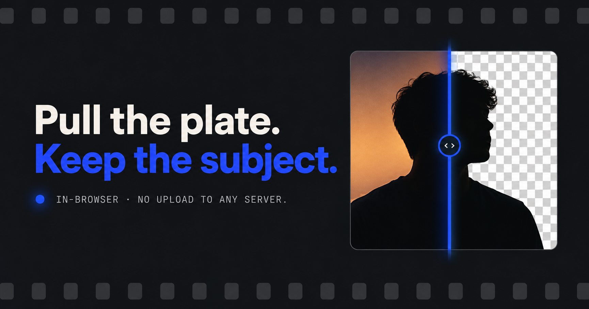

# Matte

Background remover that runs entirely in your browser. Upload up to 5 photos, the model pulls the subject off the backdrop, download the cutouts as transparent PNGs — nothing ever leaves your device.

## Features

- Upload up to 5 images at once
- Background removal runs client-side (WASM, no server round-trip, no upload)
- Per-image status: queued → keying → composited
- Download each cutout as a transparent PNG

## Author

**Ashutosh Swamy**

- [Portfolio](https://ashutoshswamy.in)
- [GitHub](https://github.com/ashutoshswamy)
- [LinkedIn](https://linkedin.com/in/ashutoshswamy)
- [X](https://x.com/ashutoshswamy_)
